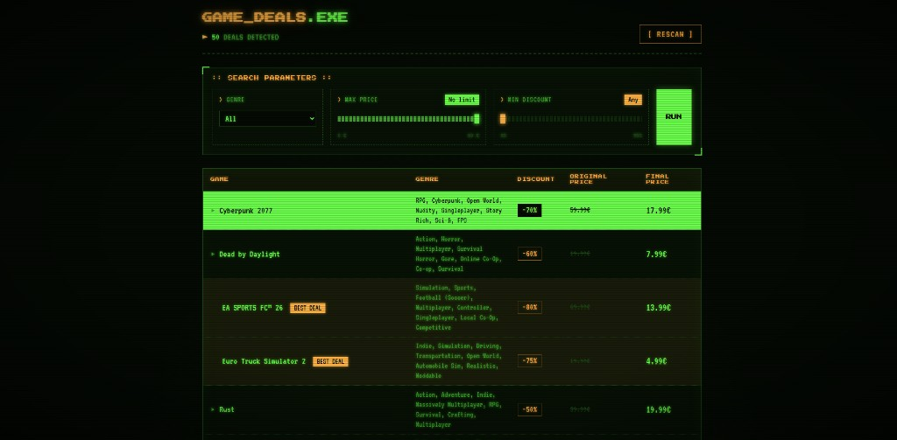

# Game Deals Scraper

A Flask web app that scrapes Steam game deals and displays them in a retro arcade-style dashboard with filters, best-deal highlighting, and live scraping progress.

**[Live Demo](https://game-deals-scraper-tjuw.onrender.com/)**



## Features

- **Steam deal scraping** — Fetches discounted games via Steam's search API with pagination and rate limiting
- **Genre enrichment** — Visits individual game pages to collect genre tags
- **Interactive filters** — Filter by genre, max price, and minimum discount with dynamic sliders
- **Best deal detection** — Highlights deals with ≥75% discount and final price ≤ €15
- **JSON cache** — Stores scraped data locally to avoid repeated requests (1-hour TTL)
- **Background scraping** — Non-blocking scrape with real-time progress bar via REST API
- **Retro UI** — Custom CRT terminal theme with scanlines, pixel fonts, and phosphor-green palette

## Tech Stack

| Layer | Tools |
|---|---|
| Backend | Python, Flask |
| Scraping | Requests, BeautifulSoup, lxml |
| Frontend | HTML, CSS, JavaScript |
| Deployment | Gunicorn, Render |

## Getting Started

### Prerequisites

- Python 3.11+
- pip

### Installation

```bash
git clone https://github.com/JosepNavarroLlana/Game-Scapper.git
cd Game-Scapper/game-deals-scrapper

python -m venv venv
venv\Scripts\activate        # Windows
# source venv/bin/activate   # macOS / Linux

pip install -r requirements.txt
```

### Run locally

```bash
python app.py
```

Open [http://localhost:5000](http://localhost:5000) in your browser.

On first load the app scrapes Steam in the background (~30–60 seconds). A progress modal shows the status. Subsequent visits use the cached data.

## Project Structure

```
game-deals-scrapper/
├── app.py                  # Flask routes, filters, background scrape thread
├── scraper/
│   └── steam.py            # Scraping, parsing, caching, progress tracking
├── templates/
│   └── dashboard.html      # Dashboard UI and scrape modal
├── static/
│   └── style.css           # Retro CRT theme
├── data/
│   └── deals_cache.json    # Local cache (gitignored)
├── requirements.txt
├── Procfile                # Render / production start command
└── render.yaml             # Render deployment config
```

## API Endpoints

| Method | Route | Description |
|---|---|---|
| `GET` | `/` | Dashboard with filtered game deals |
| `POST` | `/api/start-scrape` | Triggers background scraping |
| `GET` | `/api/scrape-status` | Returns scrape progress (percent, message) |
| `GET` | `/refresh` | Clears cache and forces a new scrape |

## Deployment

Live at [game-deals-scraper-tjuw.onrender.com](https://game-deals-scraper-tjuw.onrender.com/), hosted on [Render](https://render.com).

To deploy your own instance:

1. Push the repo to GitHub
2. Create a new **Web Service** on Render
3. Set **Root Directory** to `game-deals-scrapper`
4. Build command: `pip install -r requirements.txt`
5. Start command: `gunicorn app:app --workers 1 --threads 4 --timeout 120`

## Disclaimer

This is an educational project built for learning web scraping and Flask. It respects rate limits with delays between requests. Steam's terms of service and robots policies should be reviewed before any production use.

